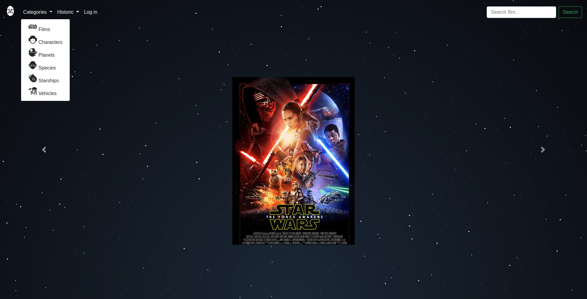

# StarWars searcher (Chewy)
&nbsp;&nbsp;&nbsp;&nbsp;This is a Python/Django app of StarWars using [Swapi](https://swapi.co/api/), it's a website called *Chewy* where you can see all the data of *Swapi* with images and different elements. This is a project to learn how to work with django and improve my skills in python.


## Getting Started
&nbsp;&nbsp;&nbsp;&nbsp;Instructions to obtain and run the application in systems with Linux (Ubuntu 18.04.2 LTS)

### Prerequisites
&nbsp;&nbsp;&nbsp;&nbsp; To execute this project you'll need the following requeriments
```
Postgres database requiered named 'swdb' with username == postgres
Python >= 3.6.8
git 
```
### Installing
&nbsp;&nbsp;&nbsp;&nbsp; To get and install this app you'll have to follow the next steps
```
git clone https://github.com/RubenZx/StarWars_Searcher.git
cd StarWars_Searcher/StarWars
pip3 install -r requeriments.txt
python3 manage.py makemigrations
python3 manage.py migrate
```
### Usage
&nbsp;&nbsp;&nbsp;&nbsp; First of all you'll need to create an admin user if you want to access to the admin part of the site, to load data and see what data you have in your database of the site (optional)
```
python3 manage.py createsuperuser
```
&nbsp;&nbsp;&nbsp;&nbsp; Now you are ready to run the aplication
```
python3 manage.py runserver
```
&nbsp;&nbsp;&nbsp;&nbsp; After this you can open your browser and type the following link [localhost:8000](http://localhost:8000/). You will see the following sections in your *website*:
* *Logo*, this is the home button
* *Categories*, a dropdown where you can see the different sections of the website
⋅⋅* Films
⋅⋅* Characters 
⋅⋅* Planets
⋅⋅* Species
⋅⋅* Starships
⋅⋅* Vehicles
* *Historic*, another dropdown where you will see the last 10 pages visited in the website
* *Log in*, this is a button to go to the admin site
* *Search bar*, to look up a film




